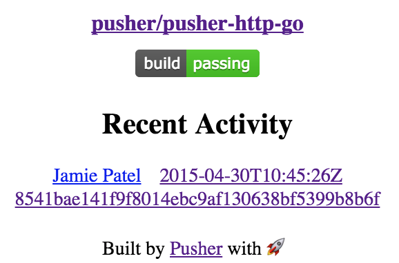

# Travis Build Status Web Component

Display the Travis CI build status of your GitHub repo. Travis badge, latest commit status and real-time updates as builds are committed and jobs are undertaken.

## Demo

[View the live demo](docs/example.html)

## Screenshot

